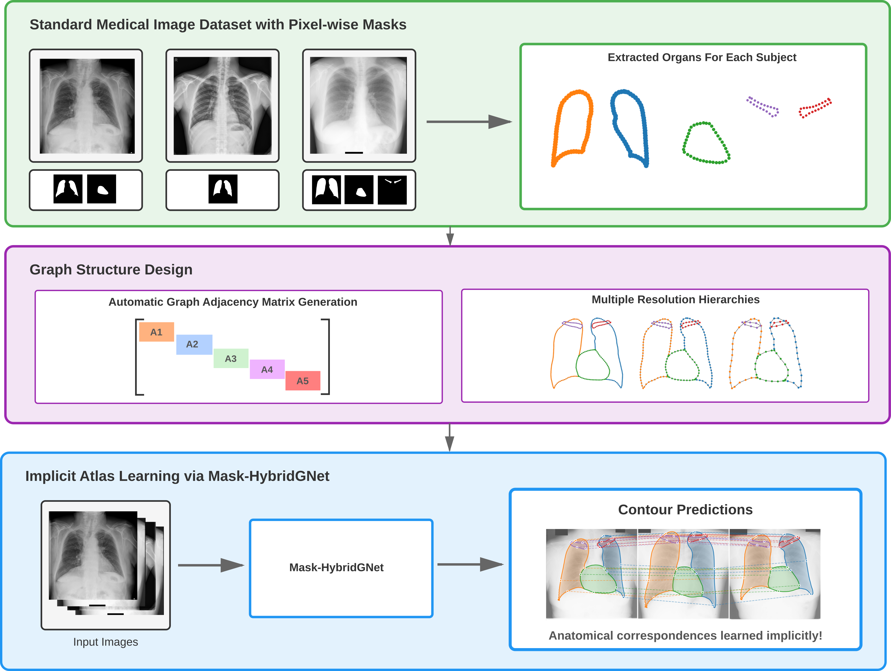
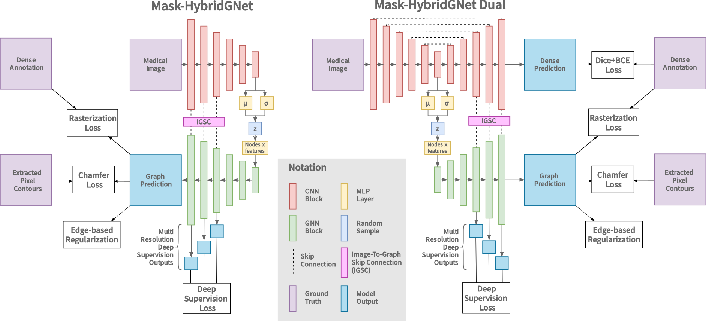

# Mask-HybridGNet: Graph-based segmentation with emergent anatomical correspondence from pixel-level supervision



Official PyTorch implementation of "Mask-HybridGNet: Graph-based segmentation with emergent anatomical correspondence from pixel-level supervision".

Available at: https://arxiv.org/abs/2602.21179

## Overview

Mask-HybridGNet trains graph-based segmentation models using standard pixel-wise segmentation masks, without requiring manually annotated landmarks with point-to-point correspondences. 



**Applications:**
- Medical image segmentation across modalities (X-ray, ultrasound, MRI)
- Temporal tracking through cardiac cycles
- Cross-slice reconstruction in MRI sequences
- Population-level morphological analysis

## Online Demo

Inference-ready environment available at: https://huggingface.co/spaces/ngaggion/MaskHybridGNet

---

## Installation

### Option 1: Docker (Recommended)

Due to complex dependencies involving custom CUDA compilations (PyTorch3D and Differentiable Rasterizer), we highly recommend using Docker to run this code. 

You can pull the image:
```bash
docker pull ngaggion/maskhybridgnet

```

**Building the Image:**
Ensure you have the NVIDIA Container Toolkit installed, then build the image from the project root:
```bash
docker build -t maskhybridgnet .

```

**Usage:**
Run the container interactively with GPU access. The `--ipc=host` flag may be required to provide sufficient shared memory for PyTorch's background data loader workers:

```bash
docker run --gpus all -it --rm --ipc=host -v $(pwd):/workspace maskhybridgnet

```

### Option 2: Local Installation

**For Inference:**
Using Python 3.10 (Recommended for PyTorch 2.0.1 compatibility), install the base dependencies:

```bash
pip install -r requirements.txt

```

**For Training:**
Training requires additional custom CUDA dependencies:

1. **PyTorch3D**: To install the Chamfer-Loss, follow the official installation instructions at https://github.com/facebookresearch/pytorch3d/blob/main/INSTALL.md
2. **Differentiable Rasterizer**: Compile the SoftRasterizer (adapted from BoundaryFormer). Note that this requires `nvcc` and a local CUDA toolkit installation:
```bash
cd losses/diff_ras
python setup.py install

```

*Original implementation: https://github.com/mlpc-ucsd/BoundaryFormer*

---

## Datasets

Evaluated on:

* **Chest X-ray**: JSRT, PadChest, Montgomery, Shenzhen, PAX-Ray++
* **Cardiac Ultrasound**: CAMUS
* **Cardiac MRI**: Sunnybrook
* **Fetal Imaging**: HC18, JNU-IFM, PSFHS

## Usage

The typical workflow has four steps: prepare a dataset, train a model, evaluate on a held-out test set, and run inference on new images.

```text
      1_Dataset_Generation_*.ipynb  →  prepared dataset folder
         ↓
      2_Trainer.py             →  ../Training/{name}/  (checkpoints + hyperparameters.json)
         ↓
      3_Evaluate.py            →  metrics on test set (Dice, HD, ASSD)
         ↓
      5_Predict.py             →  segmentations on new images
```

### 1. Prepare your dataset

Dataset-specific preprocessing notebooks are provided with the prefix `1_Dataset_Generation_*.ipynb`. Use the notebook closest to your modality as a template and adapt it to your data layout and annotation format.

**Independent representation** (one graph per organ):

* `1_Dataset_Generation_ChestXRay.ipynb`
* `1_Dataset_Generation_CAMUS.ipynb`
* `1_Dataset_Generation_HC18.ipynb`
* `1_Dataset_Generation_PAXRay_Front.ipynb`

**Unified representation** (single graph with shared organ boundaries):

* `1_Dataset_Generation_ChestXRay_Unified.ipynb`
* `1_Dataset_Generation_CAMUS_Unified.ipynb`
* `1_Dataset_Generation_PAXRay_Front_Unified.ipynb`

Each notebook builds a dataset folder that contains at least:

* `config.json` — organ list, resolutions, input size, augmentation flags
* `images/` and `landmarks/` — training samples
* `train.txt`, `val.txt`, `test.txt` — image splits
* `Independent/` or `Unified/` — adjacency matrices, downsampling/upsampling operators, atlas files

See the paper appendix for detailed configuration instructions.

### 2. Train a model

Training is launched with [`2_Trainer.py`](2_Trainer.py). The script loads the dataset configuration, builds the graph convolutional model, and saves checkpoints under `../Training/{name}/`.

**Minimal example:**

```bash
python 2_Trainer.py \
  --name MyExperiment \
  --dataset ../Dataset/CAMUS/Landmarks_3_10 \
  --representation independent
```

**Common options:**

| Flag | Description |
|------|-------------|
| `--name` | Experiment name; outputs go to `../Training/{name}/` |
| `--dataset` | Path to the prepared dataset folder |
| `--representation` | `independent` (default) or `unified` — must match the graph matrices used at dataset generation time |
| `--dual` | Use the dual-branch model (`HybridDual`) instead of the standard encoder |
| `--resume` | Resume from a `.pth` checkpoint |
| `--production` | Train on train+val+test combined (no held-out validation split) |
| `--no-raster` | Disable the rasterization loss |

**Training outputs** (in `../Training/{name}/`):

* `{name}.pth` — latest checkpoint
* `{name}_best.pth` — best validation checkpoint
* `hyperparameters.json` — model settings needed at inference time
* `dataset_config.json` — full training configuration
* TensorBoard logs

Training uses a combination of Chamfer distance on graph nodes, VAE regularization, contour smoothness terms, and (after warmup) a differentiable rasterization loss against pixel masks. See [`training/trainer.py`](training/trainer.py) for the full loop.

### 3. Evaluate on the test set

[`3_Evaluate.py`](3_Evaluate.py) computes segmentation metrics (Dice, Hausdorff distance, ASSD) on the dataset test split. It loads `hyperparameters.json` alongside the checkpoint and writes a `results.csv` per experiment.

Dataset-specific evaluation notebooks (`4_Eval*.ipynb`) contain additional analysis and plotting for the benchmarks reported in the paper.

### 4. Run inference on new images

For prediction on images outside the prepared test split, use [`5_Predict.py`](5_Predict.py). It wraps [`predict_test_set`](evaluation/utils.py) from the evaluation module: the model predicts graph node positions, which are rasterized into segmentation masks.

**Predict on a folder of images:**

```bash
python 5_Predict.py \
  --dataset ../Dataset/CAMUS/Landmarks_3_10 \
  --checkpoint ../Training/MyExperiment/MyExperiment_best.pth \
  --images /path/to/my/images \
  --output ../Results/MyExperiment/predictions
```

**Predict using the dataset test split** (omit `--images`):

```bash
python 5_Predict.py \
  --dataset ../Dataset/CAMUS/Landmarks_3_10 \
  --checkpoint ../Training/MyExperiment/MyExperiment_best.pth \
  --output ../Results/MyExperiment/predictions
```

**Export landmarks as JSON** (one file per image, organ names as keys):

```bash
python 5_Predict.py \
  --dataset ../Dataset/CAMUS/Landmarks_3_10 \
  --checkpoint ../Training/MyExperiment/MyExperiment_best.pth \
  --images /path/to/my/images \
  --output ../Results/MyExperiment/predictions \
  --landmarks
```

**Arguments:**

| Flag | Description |
|------|-------------|
| `--dataset` | Prepared dataset folder (provides graph topology, organ names, input size) |
| `--checkpoint` | Trained `.pth` weights |
| `--hyperparameters` | Optional path to `hyperparameters.json` (defaults to the checkpoint folder) |
| `--images` | Folder, single image, or `.txt` file listing paths. If omitted, uses `{dataset}/test.txt` |
| `--output` | Directory for output segmentations |
| `--landmarks` | Also write predicted landmark coordinates as JSON |
| `--representation` | Override `independent` / `unified` if needed |

**Output:** by default, one segmentation mask image per input (PNG, same filename as the source). With `--landmarks`, JSON files with per-organ landmark coordinates are saved alongside the masks.

**Requirements for inference:** the `--dataset` path must be the same dataset (or one with identical graph configuration) that was used during training, because the model architecture depends on the adjacency matrices and organ topology stored there. Only the image encoder runs on your new inputs; the graph structure comes from the dataset folder.

Example scripts for specific benchmarks: [`5_Segment_HC18.py`](5_Segment_HC18.py), [`5_Segment_CAMUS.py`](5_Segment_CAMUS.py).

### Graph Representations

Models can be trained with one of two graph representations, selected with the `--representation` flag of `2_Trainer.py`:

* `independent` (default): each organ is modelled by its own closed contour graph (per-organ block-diagonal adjacency). This is the representation previously referred to as "naive".
* `unified`: all organs share a single graph with shared boundary nodes. This is the representation previously referred to as "non-naive".

Adjacency matrices and atlas files for newly generated datasets are written to `Independent/` and `Unified/` subfolders inside the dataset directory.

**Backward compatibility.** The legacy nomenclature is still fully supported:

* The deprecated `--naive` / `--non-naive` flags continue to work as aliases for `--representation independent` / `--representation unified`.
* Checkpoints and `hyperparameters.json` files written by older runs (which only store the boolean `naive` key) load unchanged; the value is mapped to the corresponding representation automatically. New runs additionally store the `naive` flag so older inference scripts keep working.
* Datasets generated with the old `Naive/` and `NonNaive/` folder layout are still read directly. When both the new and legacy folders are present, the new `Independent/` / `Unified/` folders take precedence.

## Project Structure

```text
├── data/                          # Dataset loading and transformations
├── models/                        # Network architectures
├── losses/                        # Loss functions and differentiable rasterizer
├── training/                      # Training utilities
├── evaluation/                    # Evaluation metrics
├── utils/                         # Graph operation helpers
├── 1_Dataset_Generation_*.ipynb   # Dataset preprocessing scripts
├── 2_Trainer.py                   # Main training script
├── 3_Evaluate.py                  # Test-set evaluation (metrics)
├── 4_Eval*.ipynb                  # Dataset-specific evaluation
├── 5_Predict.py                   # Inference on new images
├── 5_Segment_*.py                 # Example inference scripts per benchmark
└── 7_Segment_From_Mask.py         # Atlas extraction from masks

```

## Hardware Requirements

* **Inference**: ~4GB VRAM
* **Training**: 12-24GB VRAM
* **Training Time**: 12-24 hours per dataset (tested on NVIDIA RTX 3090)

## Citation

If you find this code or our methodology useful in your research, please cite:

```bibtex
@article{gaggion2026mask,
  title={Mask-HybridGNet: Graph-based segmentation with emergent anatomical correspondence from pixel-level supervision},
  author={Gaggion, Nicol{\'a}s and Ledesma-Carbayo, Maria J and Christodoulidis, Stergios and Vakalopoulou, Maria and Ferrante, Enzo},
  journal={arXiv preprint arXiv:2602.21179},
  year={2026}
}

```

## Contact

For questions or issues, please open an issue on GitHub.

## License

See LICENSE file.